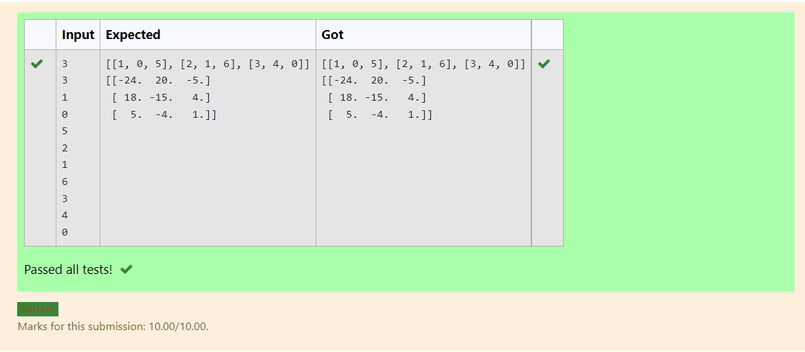

# Inverse-of-matrix

## AIM:
To write a python program to find the inverse of a matrix.

## ALGORITHM:
### Step 1:
### Step 2:
### Step 3:
### Step 4:
### Step 5:


## PROGRAM:
```
Devloped by : Dhanush.S
Ref No : 212221230020

import numpy as np
l1,l2=[],[]
r=int(input())
c=int(input())
for i in range (r):
    for j in range (c):
        num=int(input())
        l1.append(num)
    l2.append(l1)
    l1=[]
print(l2)
value1=np.array(l2)
inverse=np.linalg.inv(value1)
print(inverse)

```
## OUTPUT:


## RESULT:
Thus the program is written to Find the Matrix.
